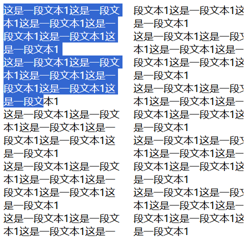
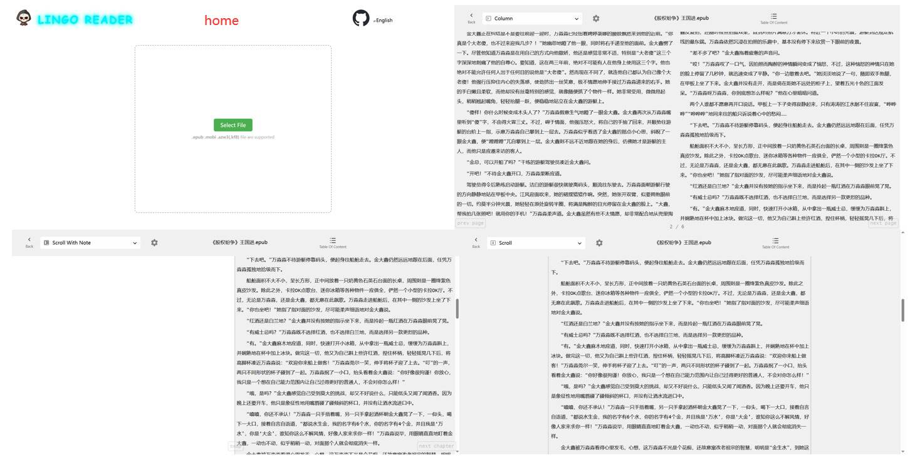

## 简介

在一些在线或者离线的阅读平台上，比如番茄、得到、笔趣阁、起点、kindle 等，虽然它们所承载的阅读内容不同，但是阅读模式主要分为两种，**分页模式**和**滚动模式**。本文介绍一下这两种模式在网页端的实现，主要是分页模式。

## 使用 overflow+scroll 的方式实现分页

分页模式的简单实现如下所示。为了方便展示删减了用于占位的内容，可以点击 [地址](https://github.com/hhk-png/lingo-reader/blob/main/docs/use%20scroll%20api%20to%20finish%20paginator.html) 下载完整内容。

```html
<!DOCTYPE html>
<html lang="zh">
  <head>
    <meta charset="UTF-8" />
    <meta name="viewport" content="width=device-width, initial-scale=1.0" />
    <title>use scroll api to implement paginator</title>
    <style>
      * {
        padding: 0;
        margin: 0;
      }

      .ebook {
        box-sizing: border-box;
        column-count: 2;
        column-gap: 20px;
        column-fill: auto;
        height: 100vh;
        overflow: hidden;
        overflow-wrap: break-word;
        padding-left: 20px;
        padding-right: 20px;
        padding-top: 20px;
      }
    </style>
  </head>

  <body>
    <button style="position: fixed; left: 0;" class="prevPage">prev</button>
    <button style="position: fixed; left: 50px;" class="nextPage">next</button>
    <div class="ebook">
      <div class="outer">
        <h1>电子书标题</h1>
        <p>
          金大鑫不再言语，只是怔怔地看着万淼淼，仿佛她在说一个不相干的人。
          在万淼淼闭眼沉醉时，他反而从刚才被质疑的尴尬中缓过气来。他捏起高脚杯凑近自己的鼻孔嗅了嗅，又轻轻放下杯子。“对不起，我说多了！”万淼淼起身拿起遥控器，选了一首《可可托海的牧羊人》，忧伤凄美的旋律瞬间充盈到船舱里。“那夜的雨，也没能留住你/山谷的风，它陪着我哭泣……”万淼淼闭上眼睛，随着旋律轻轻摇晃起来……金大鑫对这首歌没什么感觉，他认为，歌者完全是无病呻吟，天下美女多的是，犯得着这样要死要活吗？
        </p>

        <!-- 删减了 -->
      </div>
      <!-- placeholder for making sure the scrolling logic working as expected -->
      <div style="width: 100%; height: 100%; background-color: aqua;"></div>
    </div>

    <script>
      const ebook = document.querySelector('.ebook')
      const nextPage = document.querySelector('.nextPage')
      const prevPage = document.querySelector('.prevPage')
      const ebookWidth = ebook.getBoundingClientRect().width

      // !!! width + gap - padding
      const delta = ebookWidth + 20 - 20 - 20
      const scrollWidth = ebook.scrollWidth

      let pageIndex = 0
      const pageCount = Math.floor(scrollWidth / delta)
      console.log(pageCount)

      nextPage.addEventListener('click', () => {
        if (pageIndex < pageCount - 1) {
          pageIndex++
          ebook.scrollTo({
            top: 0,
            left: pageIndex * delta,
          })
        }
      })

      prevPage.addEventListener('click', () => {
        if (pageIndex > 0) {
          pageIndex--
          ebook.scrollTo({
            top: 0,
            left: pageIndex * delta,
          })
        }
      })
    </script>
  </body>
</html>
```

承载电子书内容的主要是 `div.ebook`，`.ebook` 下面是动态添加的 html 文本内容。在 css 中，最主要的三个元素为 `column-count: 2;` 、`height: 100vh;` 和 `overflow: hidden;`，设置 column 能够使元素 content 区域的布局方式改变为多列布局，但此时没有设置固定的高度，内容会自动向下蔓延。在设置了固定的高度 100vh 之后，就会改变内容的蔓延方向，转变为向右蔓延，就达到了分页的效果。但此时会展示所有的内容，并且 `.ebook` 变成了一个可以左右滚动的容器。为了展示既定的两列内容，需要设置 `overflow: hidden;` 先将多余的内容裁剪掉，此时 `.ebook` 也失去了可以手动滑动的功能。在做翻页功能时，通过 scroll API 就能实现。

在 `.ebook` 中有两部分内容，一部分为需要动态添加的书籍文本，用 `.outer` 包裹，另一部分是一个长宽都为占 100%的占位元素。在滑动到最后一页时，如果没有该占位符，就可能导致滑动不过去的情况，加上该占位元素就可以解决这个问题。并且增加该元素并不会影响内容的正常展示，浏览器可以合理的处理该元素所占的面积，不会出现因为该占位元素多了一页的情况。

实现前后翻页需要操纵向左和向右滑动的距离，每次翻页所滑动距离的绝对值相同。设置了 column-gap 之后，除最后一列元素以外，其余每一列右面都会与右边一列相隔所设置的列间距的距离。因此在代码中，每次滑动的距离 delta 为 width + gap - padding，其中的 padding 包括左右边距。在此处 delta 的计算方式为：`.ebook` 的宽度加上 column-gap 的值，然后减去 padding-left 和 padding-right 对应的值，此处都为 20 像素。`ebook.scrollWidth` 为 ebook 可以滑动的距离，将该值除以 delta 之后，就可以得到当前章节的总页数。

按照小数点后的位数，js 获取 dom 元素长宽的精度的级别分为三级。首先是 `Element.clientWidth/clientHeight`，获取的是元素不包括 border 的元素长宽，获取的值是一个向下取整的整数，精度最差。然后是 `window.getComputedStyle`，根据 box-sizing 元素获取元素的长宽，也就是说，如果 box-sizing 为 border-box，则获取的长宽包括边框部分，该 API 获取的值保留至小数点后两位，精度要比前一个好一些。最后是 `Element.getBoundingClientRect`，通过该 API 获取的长宽精度最高，有时可以保留至小数点后 10 位。

在计算滑动的距离时，如果 delta 的精度不够，当持续向一个方向翻页时，就会感觉出文本的左边界慢慢向左移或者右移的情况。除此之外还会影响总页数的计算。保险起见，在计算 ebook 的宽度时，采用的是 getBoundingClientRect 的方式。

至此，就完成了翻页阅读模式的基本功能，更复杂的一些功能可以在此基础上构建。

## 使用 overflow+translate 来实现分页

除了上面的实现思路以外，还可以基于 translate 来实现分页，基本原理与上面的实现方式一样，都是基于 columns 元素。如下所示：

```html
<!DOCTYPE html>
<html lang="en">
  <head>
    <meta charset="UTF-8" />
    <meta name="viewport" content="width=device-width, initial-scale=1.0" />
    <title></title>
    <style>
      .wrapper {
        width: 400px;
        height: 400px;
        overflow: hidden;
      }

      .container {
        width: 400px;
        height: 400px;
        columns: 2;
        transform: translate(-400px);
      }
    </style>
  </head>

  <body>
    <div class="wrapper">
      <div class="container">
        <!-- content -->
      </div>
    </div>

    <script>
      document.querySelector('.container').innerHTML =
        '<div>这是一段文本1这是一段文本1这是一段文本1这是一段文本1这是一段文本1这是一段文本1</div>'.repeat(
          30
        )
    </script>
  </body>
</html>
```

该种实现方式将需要动态添加的书籍内容放到了 `.container` 下面，在上面设置了 columns 和固定的高度，在其父元素 `.wrapper` 上设置了 `overflow:hidden`，这样就可以通过控制.container 的 translate 来实现翻页，在此处将 translate 设置为了固定值，向右翻一页。该种实现方式的一个大的无法解决的 bug 是在选中文本的过程中，如果鼠标移动到了空白处，比如列之间的间隙，就会出现反向选择所有文本的情况，极其影响用户体验。如果在给内容中的 div 元素添加一个 margin，那就更美妙了。如下图所示：



该 bug 与使用 css 的 order 所造成的 bug 类似，order 可以改变元素显示的顺序，但是无法改变静态 dom 的顺序。因为浏览器在选中文本时，是按照 dom 的静态相对位置进行文本选中的，所以也会造成前面所述的情况。如 StackOverflow 上的 [https://stackoverflow.com/questions/76686208/text-selection-problem-when-using-flexbox-order-in-html-css](https://stackoverflow.com/questions/76686208/text-selection-problem-when-using-flexbox-order-in-html-css) 这个问题，提了 7 个月了没人回答。

## lingo-reader 项目中的 reader-html 阅读器

[lingo-reader](https://github.com/hhk-png/lingo-reader) 是本人做的一个关于电子书文件解析的项目，目前包括对 epub、azw3 和 mobi 文件的解析，并且在这些文件的解析器之上抽象出了一套统一的 API，项目地址为 [https://github.com/hhk-png/lingo-reader](https://github.com/hhk-png/lingo-reader)。reader-html 是在其之上构建的一个网页端阅读器，下面主要介绍一下此阅读器。阅读器地址为 [https://hhk-png.github.io/lingo-reader/](https://hhk-png.github.io/lingo-reader/)。项目的页面如下：



### store 中的统一 API 介绍

项目的状态管理工具使用 pinia，如下为在各解析器之上构建的用于此项目的一套 API，包括章节数，当前章节等通用状态。下面会简单介绍一下其中返回的方法和变量。

每个解析器对外暴露出了对应的初始化的 API，命名格式为 `init+文件类型+File` 在浏览器环境下需要传入 File 对象，node 环境下传入文件的路径。下面代码中的 initBook 方法中，根据文件名后缀进入相应的判断，进行书籍类的初始化。其中 spine 为书的目录顺序结构，决定了电子书中章节或内容文件的阅读顺序，spine 为一个数组，不同的解析器返回的该数组的元素不同，但是都具备一个章节的 id，传入 getChapterHTMLFromId 函数中，就可以使用 book.loadChapter(id)获得处理后的章节对象。chapterNums 为章节数，fileInfo 中主要包括文件名，也可以直接通过 File.name 获取。

处理后的章节对象如下所示，其中 html 为替换完资源路径后的 html 文本，可以将该 html 直接放到页面中，css 为各 css 文件的 blob url，可以通过 fetch 获取对应 css 的文本。

```typescript
interface EpubProcessedChapter {
  css: EpubCssPart[]
  html: string
}
```

chapterIndex 为当前正在阅读的章节，progressInChapter 为章节内的阅读进度，大于等于 0，小于等于 1，表示百分比。

```typescript
import type { EpubFile, EpubSpine } from '@lingo-reader/epub-parser'
import { initEpubFile } from '@lingo-reader/epub-parser'
import { defineStore } from 'pinia'
import { ref } from 'vue'
import DOMPurify from 'dompurify'
import { initKf8File, initMobiFile } from '@lingo-reader/mobi-parser'
import type { Kf8, Kf8Spine, Mobi, MobiSpine } from '@lingo-reader/mobi-parser'
import type { FileInfo } from '@lingo-reader/shared'

const useBookStore = defineStore('ebook', () => {
  let book: EpubFile | Mobi | Kf8 | undefined
  let spine: EpubSpine | MobiSpine | Kf8Spine = []
  const chapterIndex = ref<number>(0)
  const chapterNums = ref<number>(0)
  const progressInChapter = ref<number>(0)
  let fileInfo: FileInfo = {
    fileName: '',
  }

  const initBook = async (file: File) => {
    if (file.name.endsWith('epub')) {
      book = await initEpubFile(file)
      spine = book.getSpine()
      chapterNums.value = spine.length
      fileInfo = book.getFileInfo()
    } else if (file.name.endsWith('mobi')) {
      book = await initMobiFile(file)
      spine = book.getSpine()
      chapterNums.value = spine.length
      fileInfo = book.getFileInfo()
    } else if (file.name.endsWith('kf8') || file.name.endsWith('azw3')) {
      book = await initKf8File(file)
      spine = book.getSpine()
      chapterNums.value = spine.length
      fileInfo = book.getFileInfo()
    }
  }

  const chapterCache = new Map<string, string>()
  const getChapterHTMLFromId = async (id: string): Promise<string> => {
    if (chapterCache.has(id)) {
      return chapterCache.get(id)!
    }

    const { html } = await book!.loadChapter(id)!
    // for security
    const purifiedDom = DOMPurify.sanitize(html, {
      ALLOWED_URI_REGEXP: /^(blob|https|Epub|filepos|kindle)/gi,
    })
    chapterCache.set(id, purifiedDom)
    return purifiedDom
  }

  const getChapterHTML = async () => {
    const id = spine[chapterIndex.value].id
    return await getChapterHTMLFromId(id)
  }

  const getChapterThroughId = async (id: string) => {
    chapterIndex.value = spine.findIndex((item) => item.id === id)
    return await getChapterHTMLFromId(id)
  }

  const getToc = () => {
    return book!.getToc()
  }

  const getFileName = () => {
    return fileInfo.fileName
  }

  const reset = () => {
    book!.destroy()
    book = undefined
    spine = []
    chapterIndex.value = 0
    chapterNums.value = 0
    progressInChapter.value = 0
    // clear chapter cache to avoid image conflict in different books
    chapterCache.clear()
  }

  const existBook = (): boolean => {
    return book !== undefined
  }

  const resolveHref = (href: string) => {
    return book!.resolveHref(href)
  }

  return {
    chapterIndex,
    chapterNums,
    progressInChapter,
    initBook,
    getChapterHTML,
    getChapterThroughId,
    getToc,
    getFileName,
    reset,
    existBook,
    resolveHref,
  }
})

export default useBookStore
```

getToc 为获取目录(table of content)的 API，为一个树形结构，如下所示，其中的 label 为目录项的名称，href 为处理后的章节的路径。在 epub 中，处理后的路径为 `Epub:path/to/ch.html`，在路径前加了一个 Epub 前缀，用于区分外部 url。mobi 文件的前缀为 filepos，azw3 文件的前缀为 kindle。DOMPurify 会将所有的加载资源的路径都清除，为此需要传入对应的正则，排除不需要清除的链接：`ALLOWED_URI_REGEXP: /^(blob|https|Epub|filepos|kindle)/gi`。

```typescript
interface TocItem {
  label: string
  href: string
  id?: string // 对应章节的id
  children?: TocItem[]
}
type Toc = TocItem[]
```

将该路径传入 resolveHref 方法，就能够获取对应章节的 id，和表示偏移的 dom 选择器，将该选择器传入到 querySelector，就可以获取章节内的 dom。如下：

```typescript
interface EpubResolvedHref {
  id: string
  selector: string
}
```

### 阅读器的介绍

项目的整体结构较简单，主要包括首页路由和阅读器路由，在首页选择文件之后就会跳转到阅读器界面，在阅读器界面也有返回首页的按钮。
书籍的状态存储在 pinia 中，阅读器能够同时支持不同的阅读模式，可以供用户手动切换，并且阅读进度也会在不同的阅读模式之间保持同步。目前支持的阅读模式有三种，除前面说的分页阅读和滚动模式以外，还有一个带有笔记区域的滚动模式。考虑到阅读时会有记笔记的需求，预计会在笔记区域添加一些富文本编辑器的内容，但是现在还没做，只放了一个 textarea 标签。这种将每种阅读模式单抽成一个组件的设计是为了方便以后的阅读模式的扩展。
不同的阅读模式所支持的配置不同，比如列数这个配置只在滚动模式下支持，在其他阅读模式下没有这个选项。但字体类型、字体大小等类型在所有的阅读模式下，都会支持。为了应对这种情况，该项目采取的措施是铜鼓哦兄弟组件传值的形式实现各阅读模式配置的定制化。
例如在对应阅读模式的组件中定义了列数的 ref

```typescript
const columns = ref<number>(2)
```

然后会生成如下对象，将此对象按照设定的事件向上传递，交给父组件，然后父组件在根据其中的 type 选择相应的组件，将 value 传给能够调整值的组件。将 columns 绑定到 template 之后，就能够在父组件中调整列数，然后反馈到页面上。为了方便管理，接收子组件传递过来的值的组件被封装为了一个独立的组件。具体的可以查看项目代码：[https://github.com/hhk-png/lingo-reader/tree/main/reader-html](https://github.com/hhk-png/lingo-reader/tree/main/reader-html)

```typescript
{
  type: 'adjuster',
  name, // columns
  max,
  min,
  delta,
  value: columns, // columns ref
}
```

阅读进度的保存包括章节的索引以及章节内的进度，章节内的进度使用百分比保存。分页模式下使用当前页除以总页数来计算百分比，单位为页，滚动模式下使用已经滑动的距离除以总滑动距离来计算，单位为像素。因此相同的阅读进度，会在最终计算出来的百分比上有较大的差异，如果在这两个阅读模式之间不断进行切换，就会导致阅读进度持续衰减到第 1 页，导致阅读进度的丢失。在此采取的方法是，保存分页模式下的阅读进度时，会对当前索引页加 0.5，然后再除以总页数，该种方式可以缓解阅读进度的衰减。

## 其他

针对笔记功能，目前了解到的库有 [web-highlighter](https://github.com/alienzhou/web-highlighter) 和 [rangy](https://github.com/timdown/rangy)。两者都是通过 dom 来记录划线的位置，不过 [web-highlighter](https://github.com/alienzhou/web-highlighter) 已经停止维护。

在做电子书的分页功能时，除了在 web 环境下依赖 columns 属性以外，还有的方案是自研一个排版引擎，比如 kindle、得到电子书是这么做的，得到使用的是 svg。我最开始也是沿着用 svg 做排版引擎的思路走的，如[地址](https://github.com/hhk-png/lingo-reader/tree/main/packages/svg-render)，但是后来发现原生的浏览器就可以实现分页的功能，并且排版功能只是 html 的一个子集，css 中也有很多针对排版的属性，如果自己实现，也基本上是照着抄，并且因为运行环境的问题，使用 js 实现也赶不上浏览器原生的速度。从文本显示的角度来看，使用 html 书写，在浏览器上渲染的文字，不论放多大都不会出现失真的情况，这一点和 svg 一样，虽然会受物理像素的限制，但是在这一点上两者相同。自研排版引擎的目的可能是为了保持不同设备上字体渲染的一致性，但如果不同端都基于浏览器内核渲染，似乎也可以实现渲染结果的一致性。

## 参考资料

[https://github.com/hhk-png/lingo-reader](https://github.com/hhk-png/lingo-reader) (项目地址)

[https://github.com/johnfactotum/foliate-js](https://github.com/johnfactotum/foliate-js)